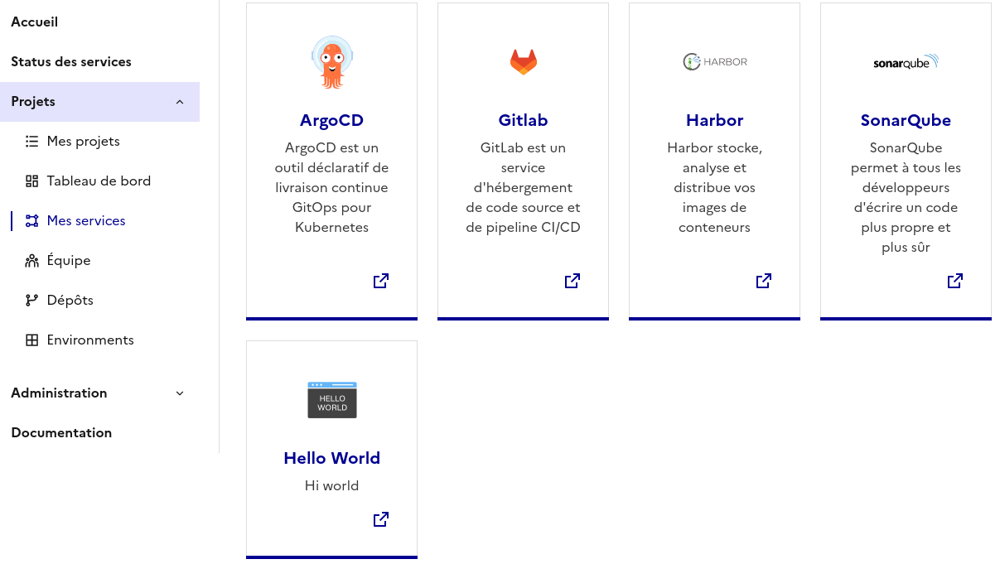
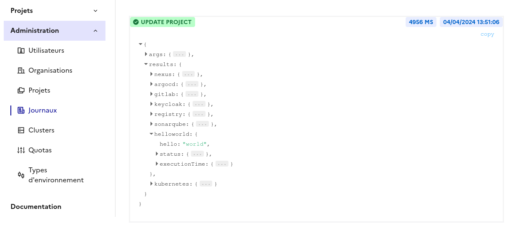

# Cloud Pi Native plugin: Hello World

La console [Cloud π Native](https://github.com/cloud-pi-native/console) a un système de hook permettant d'étendre ses fonctionnalités via des plugins.

Ce dépôt décrit la structure attendue ainsi que les différentes hook auxquels il est possible de se rattacher.

## Installation

La console Cloud Pi Native et les plugins associés sont codés en javascript/typescript

### Dépendances
Les dépendances suivantes sont nécessaires:
- "@cpn-console/hooks": Permet de s'inscrire à des hooks
- "@cpn-console/shared": Fonctions utilitaires

Les dépendances de développement suivantes sont optionnelles:
- "@cpn-console/eslint-config": configuration pour le linter
- "@cpn-console/ts-config": configuration pour typescript


## Développement
Dans cet exemple, le code est divisé en 2 fichiers:
- index.ts: point d'entrée du plugin contenant des informations à propos de ce dernier
- function.js: logique métier du plugin
- monitor.js: optionnel, logique pour pouvoir monitorer le plugin (appel à un service externe qui retourne un code http 200, etc...)

### Point d'entrée
Le fichier index.ts sert de point d'entrée pour le chargement du plugin et l'inscription aux hooks disponibles

```ts
import { type Plugin, ServiceInfos } from '@cpn-console/hooks'
import { upsertProjectHelloWorld } from './functions.js'

const infos: ServiceInfos = {
  name: 'helloworld', // Nom interne du plugin, doit être unique
  to: ({ clusters }) => 'https://example.com/', // Lien vers le service
  title: 'Hello World', // Titre sur la tuile `Mes Services`
  imgSrc: '', // Icône (url externe ou en base64)
  description: 'Hi world', // Description laconique du service
}

export const plugin: Plugin = {
  infos, // Informations générales du plugin
  subscribedHooks: { // Listes des hooks souscrits
    upsertProject: { // Nom du hook, voir liste complète des hooks disponibles
      steps: {
        main: upsertProjectHelloWorld, // Fonction que le plugin manager appelera lors de l'étape main du hook upsertProject
      },
    },
  },
}
```

La variable de type `ServiceInfos` définit un certain nombre de propriété pour le plugin.

- Propriétés obligatoires:
  - `name`: contient le nom interne du plugin, doit être unique

- Propriétés facultatives, utile pour l'affichage d'une tuile dans la page `Mes Services` (voir image plus bas):
  - `to`: l'URL vers un service externe (exemple vers une instance gitlab, harbor, vault, etc)
  - `title`: titre à afficher sur la tuile
  - `imgSrc`: URL vers une icone ou une icône encodée en base64 (voir le site [suivant](http://base64online.org/encode/) pour pouvoir le faire - penser à cocher la case Format as Data URL)
  - `description`: description laconique du service


---
La variable de type `Plugin` enregistre le plugin auprès du PluginManager.

Le propriété `subscribedHooks` définit la liste des hooks auquels notre plugin veut réagir ainsi qu'à quelle étape il doit être appelé.

Dans notre exemple, notre plugin demande à s'inscrire au hook `UpsertProject` à l'étape `main`. Ainsi quand un projet sera créé ou modifié, la fonction `upsertProjectHelloWorld` sera appelée.

#### Hooks disponibles
| Nom du hook | Description |
|-------------|-------------|
| upsertCluster | Création / modification d'un cluster |
| deleteCluster | Suppression d'un cluster |
| upsertProject | Création / modification d'un projet |
| deleteProject | Suppression d'un projet |
| getProjectSecrets |  |
| checkServices |  | 
| fetchOrganizations |  |
| retrieveUserByEmail |  |


Pour chaque hook, les étapes suivantes sont disponibles:
| Etape | Description |
|-------|-------------|
| check | |
| pre | Appel de la fonction du plugin avant l'action |
| main | Appel de la fonction du plugin après l'action |
| post | Appel de la fonction du plugin après l'action, cela permet d'avoir certain pré-requis lors de l'étape précédente |
| revert | Si un plugin échoue, cette étape est jouée (sorte de rollback pour une transaction SQL) |

Tous les plugins inscrits à une étape donnée sont appelés en même temps.

### Callback
La fonction de callback doit respecter certaines règles:
- Ne pas avoir d'erreur non gérée: try/catch
- Retourner une structure status contenant un result et un message

Voici le code minimal pour un callback sur le hook `upsertProject`.

Ce code permet d'afficher un message sur le journal de la console (voir capture d'écran après)
```ts
import { parseError, type Project, type StepCall } from '@cpn-console/hooks'

//Le type, ici Project, dépend du hook, une liste de correspondance se trouve après l'exemple
export const upsertProjectHelloWorld: StepCall<Project> = async (_payload) => {
  // Capture des erreurs
  try { 
    return {
      status: { // Structure retournant des informations sur le status de la fonction
        result: 'OK', // enum: OK ou KO
        message: 'Hello World !', // Optionnel: Message affiché dans le journal de la console (voir capture d'écran plus bas)
      },
      hello: "world" // Optionnel, il est possible d'afficher dans le journal des clés/valeurs arbitraires
    }
  } catch (error) {
    return {
      status: {
        result: 'KO', 
        message: 'An error happend while creating Grafana instance',
      },
      error: parseError(error), // parseError: fonction utilitaire permettant d'avoir la stacktrace complète de l'erreur
    }
  }
}
```

Journal de la console, disponibles pour les administrateurs



Correspondance hook / type:
| Nom du hook | Type |
|-------------|-------------|
| upsertCluster | ClusterObject |
| deleteCluster | ClusterObject |
| upsertProject | Project |
| deleteProject | Project |
| getProjectSecrets | ProjectLite, type Project avec seulement les propriétés: id, name, organization |
| checkServices | EmptyPayload |
| fetchOrganizations | EmptyPayload |
| retrieveUserByEmail | UserLite, type User avec seulemement les propriété: email |

Pour plus d'information sur les types, un diagramme est disponible [ici](docs/types.md)

Le type `EmptyPayload` est un type spécial qui ne contient rien

## Monitoring
Cette partie est optionnelle, elle permet d'afficher une tuile sur la page `Status des services`, exemple pour un service qui va bien:


Pour un service non opérationnel, la tuile affichée sera:


Le code suivant permet de monitorer le service, ici un simple appel http vers l'url `https://example.com`:
```ts
import { type Plugin } from '@cpn-console/hooks'
import { type MonitorInfos, MonitorStatus, Monitor } from '@cpn-console/shared'
import { upsertProjectHelloWorld } from './functions.js'

import axios from 'axios'

[...]

const monitor = async (instance: Monitor): Promise<MonitorInfos> => {
  instance.lastStatus.lastUpdateTimestamp = (new Date()).getTime()
  try {
    const res = await axios.get('https://example.com/', {
      validateStatus: (res) => res === 200,
    })
    if (res.status === 200) { // 200 only means api responds
      instance.lastStatus.status = MonitorStatus.OK
      instance.lastStatus.message = MonitorStatus.OK
      return instance.lastStatus
    }
    instance.lastStatus.status = MonitorStatus.ERROR
    instance.lastStatus.message = 'Service en erreur'
    return instance.lastStatus
  } catch (error) {
    instance.lastStatus.message = 'Erreur lors la requête'
    instance.lastStatus.status = MonitorStatus.UNKNOW
    instance.lastStatus.cause = error
  }
  return instance.lastStatus
}

export const plugin: Plugin = {
  infos, 
  subscribedHooks: { 
    upsertProject: { 
      steps: {
        main: upsertProjectHelloWorld, 
      },
    },
  },
  monitor,
}
```